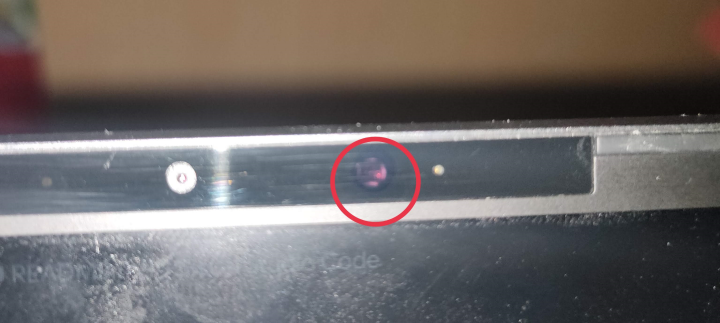

# MECHREVO CODE 01 Drivers

This repo contains a full copy of all 3rd party drivers for the MECHREVO CODE 01.

The drivers for this device seem to be all over the place, and most re-sellers are missing at least some of them.

## Also known as...

The MECHREVO CODE 01 is also known as

- PCSpecialist Fusion IV 15 (or Fusion Pro IV depending on when you ordered)
- Schenker VIA 15 PRO
- Eluktronics MAG-15u

## Driver list

### IR Camera

**Please note that not all models ship with an IR camera!**

Some resellers opted not to include the IR camera. You can check this physically by shining a flashlight at the camera area, just to the left of the rightmost microphone hole. See the image below for more info.

### Realtek card reader

This driver was downloaded directly from the Schenker website and is the latest as of 2020-11-17.

### Realtek Ethernet LAN

This driver was downloaded directly from the Schenker website and is the latest as of 2020-11-17.

### Intel WLAN

This driver was downloaded directly from the Schenker website and is the latest as of 2020-11-17.

### Intel Bluetooth

This driver was downloaded directly from the Schenker website and is the latest as of 2020-11-17.